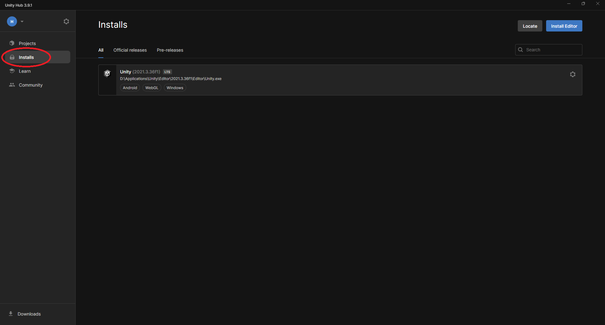
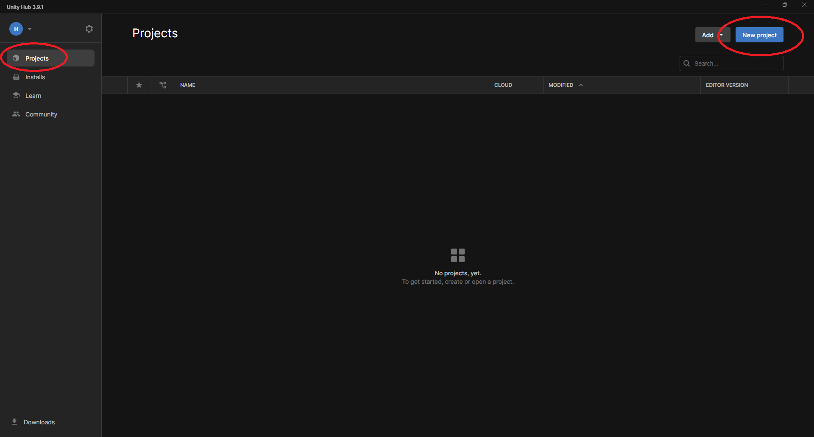
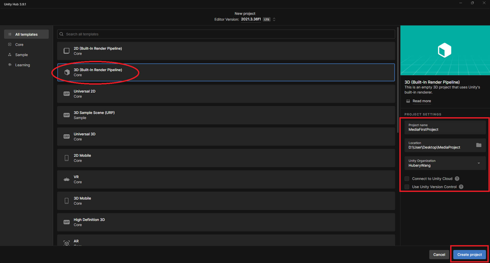
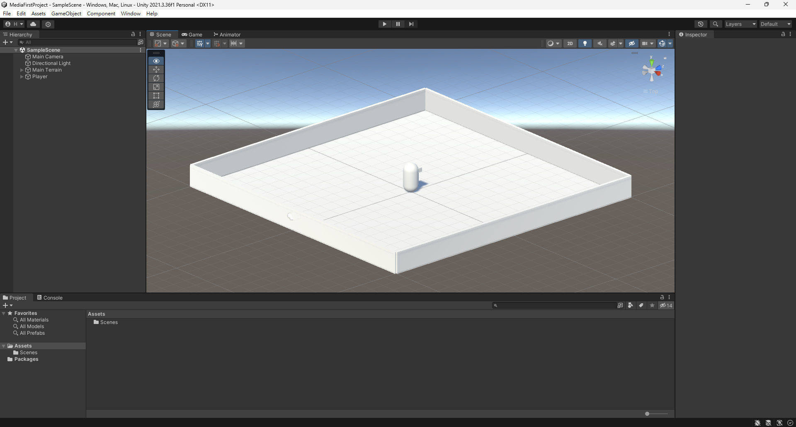
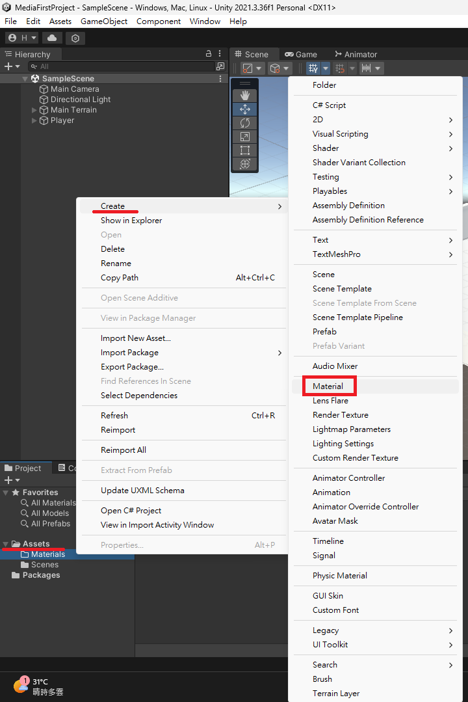
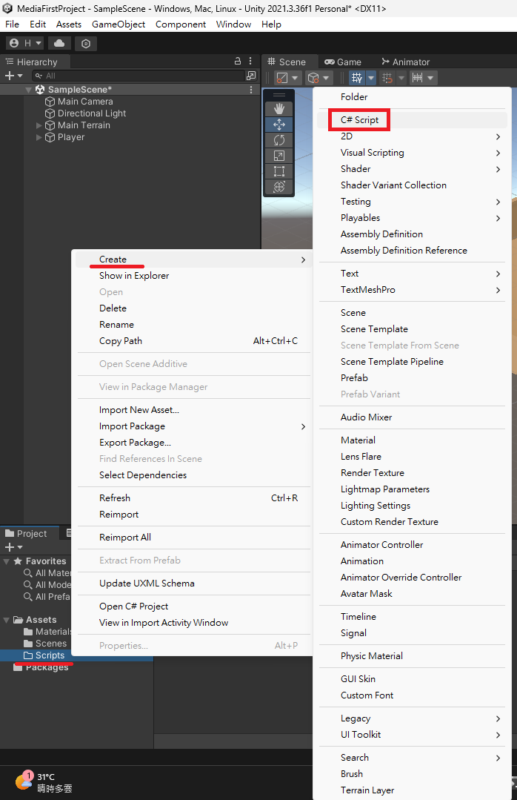
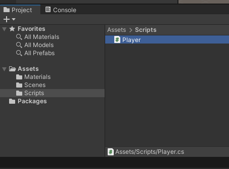
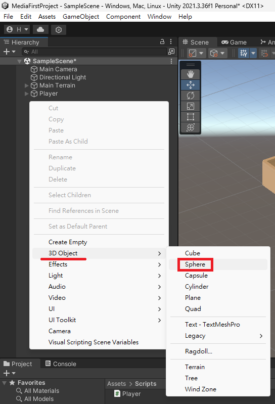
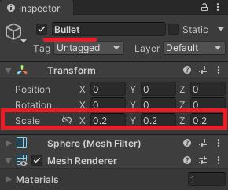
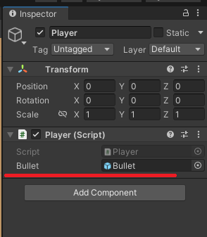

# CNU Media 2024 Unity

## What is Unity ?

Unity is a versatile and widely-used game engine developed by Unity Technologies

Ddesigned for creating both 2D and 3D games. Known for its user-friendly interface and flexibility

Unity is popular among developers ranging from beginners to professionals

### How to Install

Unity is currently installed and managed through Unity Hub, so you need to download and install Unity Hub first

Unity Hub [Download link](https://unity.com/download)


### Install Unity

In Unity Hub, switch to the "Installs" tab to manage installed Unity versions or install different versions of Unity

※ Before using Unity Hub, you must sign in with your Unity ID



## Let's start a new Unity project!

First, switch to the "Projects" tab in Unity Hub

Here, you can manage previously opened Unity projects

You can directly click on a project from the list to open it, or click the "New Project" button in the top-right corner to create a new project

Now let's click on "New Project" to continue the introduction



### Create a new project

On the project creation page

select 3D under the Templates section in the middle of the screen.

On the right side of the screen, enter the project details, such as the "project name" and "storage path"

Check whether to use "Unity Cloud" or "Unity Version Control" services

Finally, click the "Create Project" button to create the project



## In Unity

### Create terrain and Player

First, use "Plane" and "Cube" to create the floor and walls of the scene

Combine "Capsule" and "Cube" to form the Player



Let's decorate the Player with a Material. Otherwise, it will be too plain with just white

Right-click on the "Assets" folder in the "Project" panel

Then select "Create" and click on "Material" to add a new material

After adding the Material, you can give it a recognizable name

Use different Materials to decorate your Player!

※ You can create additional folders within the "Assets" folder to manage different types of assets



### Add C# Script

Create a new folder within the "Assets" folder and rename it "Scripts"

Right-click on the "Scripts" folder, then select "Create" and click on "C# Script" to add a new C# script

Rename this C# script "Player" and drag this C# script onto the "Player"





## Let's make the Player move!

Click on the "Player" script file to open it

Add the following code in the "Update" method

Allow the user to move the Player's position using the "W" , "A" , "S" and "D" keys

```cs

if (Input.GetKey(KeyCode.W))
{
    this.gameObject.transform.Translate(0, 0, .01f);
}

if (Input.GetKey(KeyCode.S))
{
    this.gameObject.transform.Translate(0, 0, -.01f);
}

if (Input.GetKey(KeyCode.A))
{
    this.gameObject.transform.Translate(-.01f, 0, 0);
}

if (Input.GetKey(KeyCode.D))
{
    this.gameObject.transform.Translate(.01f, 0, 0);
}

```

Next, move the mouse to rotate the Player's angle

Add the following code in the "Update" method.

```cs

gameObject.transform.Rotate(0, Input.GetAxis("Mouse X") * 5, 0);

```

## Create Bullet

Create a new folder within the "Assets" folder and name it "Prefabs"

Right-click in the "Hierarchy" panel,than select "3D Object" and choose "Sphere" to create a sphere to serve as the bullet



In the "Inspector" panel, rename the Sphere to "Bullet" and adjust the Scale to 0.2



Create a new C# script in the "Scripts" folder

Rename this C# script "Bullet" and drag this C# script onto the "Bullet"

Click on the "Bullet" script file to open it

Add the following code in the "Update" method

```cs

this.gameObject.transform.Translate(0, 0, .025f);

```

Drag the configured "Bullet" from the "Hierarchy" panel into the "Prefabs" folder in the "Assets"

## Shoot!

Open the "Player" C# script and add the following code at the beginning

```cs

public GameObject bullet;

```

By using the "public" access modifier, the user can assign an object to the "Player",which will treat it as a bullet

Go back to "Hierarchy" panel,select "Player"

Drag the "Bullet" from the "Prefabs" folder into the "Bullet" field in the "Inspector" panel of the "Player"



Add the following code in the "Update" method of the "Player" C# Script

Allow the user to shoot "Bullet" when clicking the left mouse button

```cs

if (Input.GetMouseButtonDown(0))
{
    Instantiate(bullet, this.gameObject.transform);
}

```

The "bullet" spawn position is too low right now

So we need to increase the height a bit

Therefore, the code should be modified as follows

Add a variable "bulletPosition" to determine where the "bullet" should be positioned

And use "Instantiate" to create the "bullet" based on the "bulletPosition"

```cs

if (Input.GetMouseButtonDown(0))
{
    var bulletPosition = this.gameObject.transform.position;
    bulletPosition.y += 1;
    bulletPosition.z += 1;
    Instantiate(bullet, bulletPosition, this.transform.rotation);
}

```
